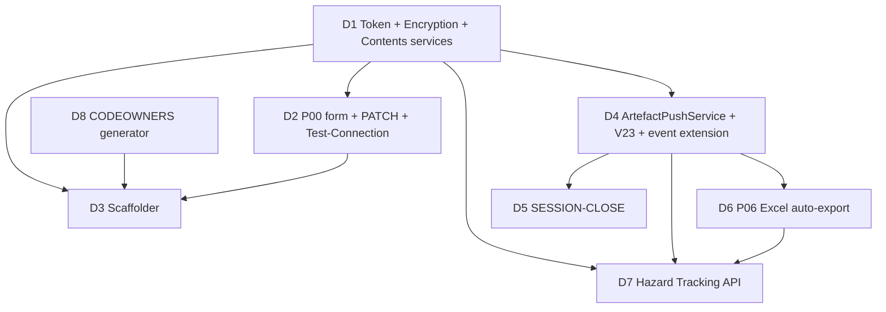

# Plan 4c — GitHub Integration + Platform Extensions — Solution Design

> Design only. No implementation. This document is the agreed design for the eight
> Plan 4c deliverables, delivered in a defined build order.

## Cross-cutting facts that anchor every deliverable

- **Existing event contract:** `ArtefactPublishedDomainEvent(Guid ProjectId, string FilePath, string S3Key, string ContentType)`.
  It carries **no `ArtefactId`** and **no `Version`**. Two deliverables (push-failure-log needs
  `artefact_id`; commit messages need `v{version}`) require data the event does not currently carry.
  This is the single biggest integration decision — see Open Question 1.
- **Existing handler** `ArtefactPublishedDomainEventHandler` is `sealed` with a `HashSet` content-type
  gate and a try/catch-swallow body. Plan 4c **extends** it (adds 3 best-effort side effects) rather
  than replacing it. It fires from `SaveChangesAsync` **before** `base.SaveChangesAsync`, so S3 content
  is already written and readable — but the DB row is **not yet committed**. A `push_failure_log`
  insert from inside the handler participates in the same unit of work.
- **`ClosedXML` is already referenced** (`Directory.Packages.props` v0.104.2). Deliverable 6 reuses
  `IHazardLogExcelBuilder` + `IHazardRegistryParser`. No new Excel dependency.
- **`Polly` is NOT a dependency.** Must be added — `Microsoft.Extensions.Http.Resilience` (preferred,
  .NET 10 native) or `Polly` v8. See Open Question 6.
- **No snake_case convention** — every property needs explicit `HasColumnName`. Table names singular
  snake_case. New-table PK pattern `{table}_uuid` with `uuid_generate_v4()` — **but note** the existing
  `project` table uses `project_id` as PK. New tables follow the new convention; existing tables keep
  their columns.
- **Next Flyway version is V21** (current head V20).

---

## Deliverable 1 — GitHub App Token Service

### Interfaces (Domain layer — `Genesis.AI.Domain/Interfaces/`)

```csharp
public interface ISecretEncryptionService
{
    string Encrypt(string plaintext);
    string Decrypt(string ciphertext);
    string Mask(string ciphertext);   // returns "••••••••", never decrypts
}

public interface IGitHubTokenService
{
    Task<string> GetInstallationTokenAsync(string installationId, CancellationToken ct);
}

public interface IGitHubContentsService
{
    Task<GitHubPushResult> PushFileAsync(
        string installationToken, string owner, string repo, string path,
        byte[] content, string commitMessage, string? existingSha, CancellationToken ct);
}
```

### New types (Domain)

- `GitHubPushResult` — `sealed record (string CommitSha, string FileUrl)`.
- `GitHubAuthenticationException : Exception` — thrown by `IGitHubTokenService` on JWT/exchange failure.
- `GitHubFileTooLargeException : Exception` — thrown by `IGitHubContentsService` when `content.Length > 12 * 1024 * 1024`.
- `GitHubContentResponse` / `GitHubPutResponse` — internal DTOs for GitHub API JSON (implementation-layer only).

### Implementation classes (`Genesis.AI.Infrastructure/Services/GitHub/`)

**`AesSecretEncryptionService : ISecretEncryptionService`** (singleton)
- AES-256-GCM. Key read **once at construction** from env var `SECRET_ENCRYPTION_KEY` (32-byte base64).
  Fail fast in constructor if missing/wrong length — boot-time guard, not per-call.
- `Encrypt`: random 96-bit nonce per call, output = `base64(nonce ‖ tag ‖ ciphertext)`. GCM over CBC —
  authenticated, prevents tamper (edge-case-correct at equal code size).
- `Decrypt`: splits, verifies tag, throws `CryptographicException` on tamper.
- `Mask`: returns constant `"••••••••"` — never touches the key.
- `ponytail:` uses `System.Security.Cryptography.AesGcm` from the BCL — no new dependency.

**`GitHubAppTokenService : IGitHubTokenService`** (singleton — holds the token cache)
- Reads `GITHUB_APP_ID` and `GITHUB_APP_PRIVATE_KEY` (PEM) from env via `IConfiguration`/`IOptions`.
  **Never** from DB, never logged.
- Mints RS256 JWT: `iat = now-60s` (clock-skew guard), `exp = now+10min`, `iss = appId`. Uses BCL
  `RSA.ImportFromPem` + `System.IdentityModel.Tokens.Jwt` (confirm lib present — see Open Question 7).
- Exchanges JWT → installation token: `POST /app/installations/{installationId}/access_tokens`.
- **Cache:** `ConcurrentDictionary<string installationId, (string token, DateTimeOffset expiresAt)>`.
  Return cached token if `expiresAt - now > 5min` safety margin; otherwise re-mint. `TimeProvider` injected.
- Throws `GitHubAuthenticationException` (wrapping inner) on any failure.
- Polly resilience (429 + transient 5xx/network): 3 attempts, exponential backoff, **max 30s delay**,
  honours GitHub's `Retry-After` header when present.

**`GitHubContentsService : IGitHubContentsService`** (typed `HttpClient`)
- `AddHttpClient<...>()` with base address `https://api.github.com`, `User-Agent: genesis-ai`,
  `Accept: application/vnd.github+json`, `X-GitHub-Api-Version` header.
- `PushFileAsync`: 12 MB guard first (throw before any network). `existingSha` supplied → PUT with `sha`;
  null → defensive GET-for-SHA if PUT returns 422 "sha wasn't supplied" (self-healing create-vs-update race).
  Content `Convert.ToBase64String`. Bearer = installation token (passed in, never cached here).

### DI registration

```csharp
private static void AddGitHubIntegration(IServiceCollection services, IConfiguration configuration)
{
    services.AddSingleton<ISecretEncryptionService, AesSecretEncryptionService>();
    services.AddSingleton<IGitHubTokenService, GitHubAppTokenService>();
    services.AddHttpClient<IGitHubContentsService, GitHubContentsService>()
            .AddResilienceHandler("github", ...);  // 429 + transient, 3 attempts, max 30s
}
```
Called from `AddInfrastructure`. Add resilience library to `Directory.Packages.props`.

### Unit tests (RED first)

- `AesSecretEncryptionService`: encrypt→decrypt round-trips; two encryptions of same plaintext differ
  (nonce); tamper throws; `Mask` returns bullets without decrypting; constructor throws on missing/short key.
- `GitHubAppTokenService`: JWT has correct `iss`/`exp`/`iat`; caches within TTL (2 calls → 1 exchange,
  mock `HttpMessageHandler`); re-mints past safety margin; throws `GitHubAuthenticationException` on 401.
- `GitHubContentsService`: `>12MB` throws `GitHubFileTooLargeException` (assert handler never invoked);
  content base64-encoded in PUT body; `existingSha` flows into `sha`; returns `CommitSha`+`FileUrl`;
  429 retried then succeeds (mock handler queue).

### Risks / edge cases

- **Clock skew** on JWT `iat` → 60s backdate.
- **Installation token TTL vs long tool loops** — 1h ample for a single push; cache margin prevents
  mid-flight expiry.
- Private key with literal `\n` vs real newlines from env — normalise (`.Replace("\\n", "\n")`), test both.
- **Never** log the `Authorization` header — audit the resilience handler's logging.

---

## Deliverable 2 — P00 Project Setup Form Extension

### Flyway migrations

**V21__add_project_github_config.sql** and **V22__add_p00_fields_to_projects.sql** — as specified in the
brief. Both `ALTER TABLE project ADD COLUMN ... NULL`. No PK/timestamp columns (existing table).

### Domain changes

- `Project` aggregate gains nullable properties for all V21/V22 columns: `GitHubApiRepoUrl`,
  `GitHubAppRepoUrl`, `GitHubRepoOwner`, `GitHubRepoName`, `GitHubInstallationId`, `FigmaFileUrl`,
  `FigmaPatEncrypted`, `ReleaseType`, `AssuranceRequired`, `PilotDeploymentProcess`, `CsoRoleAssigned`,
  `IgOwnerRoleAssigned`, `SecurityReviewerAssigned`, `MedicalDeviceFlag`.
- Methods `Project.UpdateP00Configuration(...)` and `Project.SetGitHubConfig(...)` (mutate + `UpdatedAt`
  via injected `TimeProvider` at handler level). Behaviour in the aggregate, not the handler.
- `Project.HasGitHubConfig => GitHubInstallationId is not null` — used by push service to skip silently.

### EF configuration (`ProjectEntityTypeConfiguration`)

Add one `builder.Property(...).HasColumnName(...)` per new column, matching V21/V22 exactly. All optional
(`.IsRequired(false)`), `.HasMaxLength()` for the VARCHARs (500/200/100/50). `FigmaPatEncrypted` → `text`,
no max length.

### API — `PATCH /api/v1/projects/{id}`

- New action on `ProjectsController`, `[Authorize(Policy = "ProjectWrite")]`, `[Consumes("application/json")]`.
- Request model `UpdateProjectRequest` (Features/Projects/) — all P00 fields nullable; `FigmaPat` is
  **plaintext in**, never stored plaintext.
- `UpdateProjectCommand` + handler + `UpdateProjectCommandValidator` (FluentValidation): validate GitHub
  URL format if provided (`https://github.com/{owner}/{repo}`), derive `github_repo_owner`/`github_repo_name`
  from URL, validate `release_type` against an allowed set.
- Figma PAT: if present → `ISecretEncryptionService.Encrypt` → store in `figma_pat_encrypted`. Emit
  **one-time plaintext** in the PATCH response with the fixed warning. Log audit `{ projectId,
  replacedByErn, replacedAt }` — never the value.
- **Response model `ProjectResource`**: add `FigmaPatConfigured` (bool = `FigmaPatEncrypted is not null`).
  **Never** serialise `FigmaPatEncrypted`. AutoMapper profile must **explicitly ignore** the encrypted
  column (add a mapping test asserting the ciphertext never appears in serialised JSON).
- **First-save-of-GitHub-config trigger:** if PATCH transitions `GitHubInstallationId` null→set, enqueue
  `ScaffoldGenesisStructureAsync` (D3) **after** the DB commit (best-effort, non-blocking).

### Test Connection endpoints

- `POST /api/v1/projects/{id}/test-github` → mint token, `GET /repos/{owner}/{repo}`, assert
  `permissions.push == true`. Return `TestConnectionResponse { bool Valid, string? RepoFullName, string? Error }`.
  Never log token.
- `POST /api/v1/projects/{id}/test-figma` — **design now, Wave H build later.** Decrypt PAT, call Figma
  `GET /v1/me`, return `{ valid, workspaceName }`. Interface stubbed; action gated behind feature flag or
  `[ApiExplorerSettings(IgnoreApi = true)]` until Wave H.

### Tests

- Validator: bad GitHub URL rejected; owner/name derived correctly.
- Handler: Figma PAT encrypted before persist (stored ≠ plaintext, decrypts back); audit record written;
  response contains plaintext exactly once.
- **Security test (critical):** GET project never returns `figmaPatEncrypted` nor plaintext.
- Integration: PATCH then GET → GET shows `figmaPatConfigured: true`, no ciphertext.

### Risks

- **AutoMapper leakage** of the encrypted field — explicit `.Ignore()` + serialisation assertion test.
- Owner/name diverging from URL — single source: parse URL, populate both.

---

## Deliverable 3 — `ScaffoldGenesisStructureAsync`

### Interface + class (`Genesis.AI.Infrastructure/Services/GitHub/`)

```csharp
public interface IGenesisStructureScaffolder
{
    Task ScaffoldAsync(Guid projectId, string userErn, CancellationToken ct);
}
```

`GenesisStructureScaffolder` (scoped) — `IProjectRepository`, `IGitHubTokenService`,
`IGitHubContentsService`, `IProjectMarkdownGenerator`, `ICodeownersGenerator` (D8), `TimeProvider`,
`ILogger`, `IAssemblyVersionProvider` (thin wrapper over entry-assembly version for the
`Genesis-AI-Version` trailer — reused by every commit message).

### Behaviour

1. Load project; if no GitHub config → return (caller guards).
2. **Idempotency:** per-file existence check before each push (re-runs self-heal partial scaffolds).
3. Mint installation token once, reuse for all pushes.
4. Push each `.gitkeep` (empty byte[]), `CODEOWNERS`, and `PROJECT.md` with scaffold commit message
   (`Provisioned-By`/`Triggered-By`/`Project-ID`/`Genesis-AI-Version` trailers).
5. `ponytail:` sequential pushes — GitHub Contents API has no atomic multi-file create. Ceiling: ~11
   sequential PUTs. Upgrade path: Git Trees API for one-commit atomic scaffold.

### `IProjectMarkdownGenerator` → `PROJECT.md`

Pure `string Generate(Project project)` — renders P00 fields (name, code, release type, assurance flag,
pilot/deployment process, three role-assigned yes/no, medical device flag, repo URLs). **No names, no
ERNs.** Also used by the PATCH-triggered `PROJECT.md update` path (commit `chore(project): update PROJECT.md`).

### Tests

- Idempotent: files exist → zero writes.
- All expected paths pushed exactly once (capture args).
- Commit message contains all trailers with correct values.
- `PROJECT.md`/`CODEOWNERS` contain no ERN/name.

### Risks

- Partial scaffold — per-file idempotency check (not just `.gitkeep`) so re-runs self-heal.

---

## Deliverable 4 — `GitHubArtefactPushService`

### Interface + class

```csharp
public interface IGitHubArtefactPushService
{
    Task PushAsync(Guid projectId, Guid artefactId, string filePath, int version,
                   string contentType, string s3Key, string userErn, CancellationToken ct);
}
```

`GitHubArtefactPushService` (scoped) — `IProjectRepository`, `IArtefactStorageService`,
`IGitHubTokenService`, `IGitHubContentsService`, `IPushFailureLogRepository`, `TimeProvider`,
`IAssemblyVersionProvider`, `ILogger`.

### Behaviour

1. Load project; if `!project.HasGitHubConfig` → return silently.
2. Map source path → `.genesis/` path via `GitHubPathMapper` (pure, table-driven from the brief).
   Unmapped path → log + return.
3. Read content from S3 (`GetContentAsync` for text, `GetBytesAsync` for binary xlsx/html — confirm bytes
   API exists, Open Question 4).
4. Resolve existing SHA (GET) then PUT with `feat(artefacts): approve {filePath} v{version}` + trailers.
5. **Best-effort:** wrap whole body in try/catch. On failure → insert `push_failure_log` row and swallow.
   **Never throw.**

### Path mapping

```
requirements/REQ-*.md          → .genesis/requirements/
requirements/CHANGE-*.md       → .genesis/requirements/
architecture/ARCH-*.md         → .genesis/architecture/
clinical-safety/DCB0129-*.md   → .genesis/clinical-safety/
clinical-safety/DCB0129-*.xlsx → .genesis/clinical-safety/
ig/IG-*.md                     → .genesis/ig/
security/SEC-*.md              → .genesis/security/
prototype/index.html           → .genesis/prototype/
session-close/*.md             → .genesis/session-close/
project/PROJECT.md             → .genesis/project/
```

### Wiring into `ArtefactPublishedDomainEventHandler`

Extend the existing handler: after the pgvector block, call `IGitHubArtefactPushService.PushAsync(...)`
inside its own try/catch (independent of indexing). **Requires `ArtefactId` and `Version` on the event**
(Open Question 1). Acting user: add `PublishedByErn` to the event (Open Question 2).

### V23 migration + entity

**V23__add_push_failure_log.sql** — as specified. Entity `PushFailureLog` (Domain aggregate) +
`PushFailureLogEntityTypeConfiguration` with `ToTable("push_failure_log")` and explicit `HasColumnName`
for every column (`push_failure_log_uuid` PK, `project_id`, `artefact_id`, `file_path`, `error_message`,
`failed_at` TIMESTAMPTZ, `retry_count`, `resolved_at`). `IPushFailureLogRepository` + impl. Timestamps
via `TimeProvider`.

### Tests

- No GitHub config → returns, no push, no failure log.
- Happy path → correct `.genesis/` target path, base64 content, commit message + version trailer.
- Push throws → `push_failure_log` row written (retry_count=0), no exception propagates.
- Path mapper: every source prefix → correct target; unmapped → skipped.
- Handler test: indexing failure does not prevent push; push failure does not prevent indexing.

### Risks

- **Event fires pre-commit** — keep push synchronous within the handler so it's bound to the same UoW.
  An async push completing after rollback would push a non-existent artefact. Note the rollback edge
  case; outbox is the upgrade path (Open Question 3).
- 12MB guard → `GitHubFileTooLargeException` caught → logged to `push_failure_log`.

---

## Deliverable 5 — SESSION-CLOSE Endpoint

### Endpoint

`POST /api/v1/conversations/{id}/session-close`, `[Authorize(Policy = "ConversationWrite")]`. New
`ConversationSessionCloseController` (Features/Conversations/) or action on an existing conversation controller.

### Flow → `GenerateSessionCloseCommand` + handler

1. Load conversation → resolve `StageType` → map to `P0{n}` + stage name via `SessionCloseStageMap` (P01–P08).
2. One Bedrock call using the **stage-parameterised `session-close-protocol` skill** (new embedded skill
   in `Infrastructure/Skills/`). Inject stage name + transcript summary.
3. Store result in S3 as `session-close/SESSION-CLOSE-P0{n}.md`.
4. **Upsert artefact by filePath** (`IArtefactRepository.GetByProjectAndFilePathAsync` → new version if
   exists, else create). `CreateS3Artefact` with `isPublished: true` → raises `ArtefactPublishedDomainEvent`
   → D4 pushes to GitHub with commit `docs(session): close session P0{n} — {stageName}`.

### New pieces

- `session-close-protocol.md` skill (embedded resource) — stage-parameterised template.
- `SessionCloseStageMap` — `StageType → (string Code /*P01*/, string StageName)`.
- `GenerateSessionCloseCommand`/Handler/Result. Response `SessionCloseResponse { filePath, version }`.

### Tests

- Stage map: each of P01–P08 maps correctly; P09/P10 rejected or excluded (Open Question 5).
- Upsert: second call on same stage → version 2, **not** a duplicate file.
- Publishes → event raised.
- Bedrock call uses the stage-parameterised skill (mock `IAiService`, assert prompt contains stage name).

### Risks

- Bedrock latency/failure — session-close **is** the primary action, so it may fail the request
  (not best-effort). Return a clear error.

---

## Deliverable 6 — P06 Excel Export

**Reuses existing infrastructure — no new Excel code.** Codebase already has `IHazardRegistryParser` +
`IHazardLogExcelBuilder` (ClosedXML). D6 wires an **automatic** export off approval, distinct from the
on-demand `HazardLogController`.

### Design

- **Trigger:** in `ArtefactPublishedDomainEventHandler`, when `FilePath` starts with
  `clinical-safety/DCB0129-` **AND** `ContentType == "text/markdown"`.
- New `IP06ExcelExportService.GenerateAndPushAsync(projectId, artefactId, filePath, s3Key, userErn, ct)` (scoped).
- **Data extraction:** if `DCB0129-{id}.md` uses the same `## HAZ-DOC-NNN` grammar as `HAZARD-REGISTRY.md`,
  reuse `IHazardRegistryParser` → `IReadOnlyList<HazardRecord>`. Else a new `IDcb0129Parser` producing the
  same `HazardRecord`. Prefer reuse (Open Question 8). Sections: Hazard Log, Control Measures, Residual
  Risk, Sign-off.
- **Render:** existing `IHazardLogExcelBuilder.Build(...)` → `byte[]`.
- **Store:** S3 as `clinical-safety/DCB0129-{id}.xlsx`, upsert artefact
  (`ContentType = spreadsheetml.sheet`, `isPublished: true`).
- **Push:** the xlsx upsert raises its own `ArtefactPublishedDomainEvent` → D4 pushes it
  (`Convert.ToBase64String(excelBytes)` inside `PushFileAsync`). **No recursion:** the xlsx event has
  `ContentType != text/markdown`, so the DCB0129-md trigger won't re-fire.
- Best-effort: failure logged, never blocks approval.

### Tests

- md approval with matching path+type → xlsx generated, stored, pushed.
- xlsx approval → does **not** re-trigger export (no infinite loop).
- Non-DCB0129 markdown → no export.
- Builder failure → logged, approval unaffected.

### Risks

- **Infinite loop** if xlsx re-triggers export — `text/markdown` guard prevents it; keep a test locking it in.
- Parser grammar mismatch (Open Question 8).

---

## Deliverable 7 — P06 CS Team Hazard Tracking DB API

### Interface + types

```csharp
public interface IHazardTrackingApiService
{
    Task PostHazardsAsync(Guid projectId, IReadOnlyList<HazardTrackingRecord> hazards, CancellationToken ct);
}
```

Use a **new DTO** `HazardTrackingRecord` matching the brief's 7-field shape (`HazardId, Description,
Severity, Likelihood, ControlMeasure, ResidualRisk, Status`) to avoid coupling the external contract to
the internal 15-field `HazardRecord` (Open Question 9). Map `HazardRecord` → `HazardTrackingRecord`.

### Implementation

`HazardTrackingApiService` (typed `HttpClient`) — base URL from `HazardTrackingApi:BaseUrl` (plain), API
key from `HazardTrackingApi:ApiKey` **decrypted via `ISecretEncryptionService`** at call time. Polly
3-attempt exponential backoff. POST hazards as JSON. Best-effort: try/catch, log, never throw.

- **Config binding:** `HazardTrackingApiOptions { BaseUrl, ApiKey }`. API key encrypted in appsettings —
  decrypt on read. Never log key or URL-with-key.
- **Trigger:** same handler branch as D6 (DCB0129 markdown). Extract hazards via the same parser, map,
  POST.

### Tests

- DCB0129 approval → `PostHazardsAsync` called with mapped hazards.
- API returns 500 → retried 3× → logged, approval unaffected.
- API key decrypted before use (decrypted value sent, never ciphertext).
- Non-DCB0129 → not called.

### Risks

- External API down → retries then swallow. No blocking.
- Key handling — decrypt just-in-time, never hold plaintext in a field.

---

## Deliverable 8 — CODEOWNERS File

### Design

- `ICodeownersGenerator.Generate() : string` (pure, static content from the brief — three team-based
  ownership lines for the P06/P07/P08 prompt files). No names/ERNs.
- Committed **once** during `ScaffoldGenesisStructureAsync` to `.genesis/CODEOWNERS`.
- `ponytail:` content is static — a pure generator returning a const string. Promote to config-driven if
  future teams are added.

### Content

```
# Genesis AI Pipeline Prompt Ownership
# Team-based — update team membership in GitHub org settings, not here

/src/Genesis.AI.Infrastructure/Prompts/Pipeline06ClinicalSafety.md      @emisgroup/clinical-safety-owners
/src/Genesis.AI.Infrastructure/Prompts/Pipeline07InformationGovernance.md @emisgroup/ig-owners
/src/Genesis.AI.Infrastructure/Prompts/Pipeline08Security.md            @emisgroup/security-owners
```

### Tests

- Output contains the three prompt paths + `@emisgroup/*-owners` teams, no ERNs/names.
- Scaffolder commits `.genesis/CODEOWNERS` exactly once.

---

## Build order (dependency-reasoned)



1. **D1** first — everything depends on token/encryption/contents.
2. **D2** (P00 + V21/V22) — needs `ISecretEncryptionService` (D1) for Figma PAT. Provides the GitHub
   config that D3/D4 read.
3. **D8** (CODEOWNERS generator) — trivial, needed by D3.
4. **D3** (Scaffolder) — needs D1 + D2 + D8 + PROJECT.md generator.
5. **D4** (ArtefactPushService + V23 + event extension) — needs D1. **Where the event-shape change
   (ArtefactId/Version/PublishedByErn) lands.** Foundational for D5/D6/D7.
6. **D5** (SESSION-CLOSE) — needs D4.
7. **D6** (P06 Excel auto-export) — needs D4 + existing builder.
8. **D7** (Hazard Tracking API) — needs D1 + D4/D6.

---

## Copilot prompt decomposition (RED before GREEN, 2 prompts per concern)

Baseline: **810 unit + 124 integration**. Verify exact counts after every GREEN prompt.

| # | Prompt | RED/GREEN | Covers |
|---|--------|-----------|--------|
| 1 | D1a tests | RED | Encryption + token + contents service unit tests (mock HttpMessageHandler) |
| 2 | D1a impl | GREEN | AES-GCM, JWT mint+cache, contents PUT/GET, Polly, exceptions, DI |
| 3 | D2a tests | RED | V21/V22 entity mapping, PATCH validator, PAT encrypt, GET-never-leaks |
| 4 | D2a impl | GREEN | Migrations, entity+config, command/handler/validator, PATCH + Test-GitHub, one-time PAT view |
| 5 | D3 tests | RED | Scaffolder idempotency, path set, PROJECT.md/CODEOWNERS no-ERN, commit trailers |
| 6 | D3 impl | GREEN | Scaffolder + PROJECT.md generator + assembly-version provider + PATCH trigger wiring |
| 7 | D4 tests | RED | Path mapper, push best-effort, push_failure_log, event-extension independence |
| 8 | D4 impl | GREEN | V23 + entity + repo, event shape change, push service, handler extension |
| 9 | D5 tests | RED | Stage map, upsert-not-duplicate, publishes event, skill parameterisation |
| 10 | D5 impl | GREEN | Endpoint, command/handler, session-close skill, S3 upsert |
| 11 | D6+D7 tests | RED | Auto-export trigger, no-loop guard, hazard POST, retry, key decrypt |
| 12 | D6+D7 impl | GREEN | P06 export service, hazard tracking service, handler branch, config options |

D8 folds into prompt 5/6 (one-method generator). Fresh-context reviewer prompts after prompts 2, 4, 8
(the security-critical ones).

---

## Open questions (need answers before build)

1. **Event shape change** — OK to add `Guid ArtefactId`, `int Version`, `string PublishedByErn` to
   `ArtefactPublishedDomainEvent`? D4/D5/D6 commit messages and `push_failure_log` require them.
   (Strongly recommended.)
2. **Acting user in the handler** — carry `PublishedByErn` on the event, or resolve via ambient
   `ICurrentUserAccessor`? (Recommend on the event.)
3. **Push timing vs pre-commit event** — accept synchronous-in-handler push (bound to the UoW, tiny
   rollback-race window) or introduce a transactional outbox? (Recommend synchronous for now.)
4. **`IArtefactStorageService` bytes API** — does it expose `GetBytesAsync` for binary (xlsx/html), or
   only string `GetContentAsync`? D4 push of xlsx/html needs bytes.
5. **SESSION-CLOSE stages** — brief lists P01–P08 only. P09 (Normalisation) / P10 (Planning) excluded
   deliberately? Reject or no-op them?
6. **Resilience library** — `Microsoft.Extensions.Http.Resilience` (native .NET 10, preferred) vs `Polly`
   v8 direct? Which does the org standardise on?
7. **JWT library** — is `System.IdentityModel.Tokens.Jwt` (or `Microsoft.IdentityModel.*`) already
   transitively available (TestFramework's `MockTokenGenerator` suggests yes)? Confirm before adding.
8. **DCB0129 doc grammar** — does `DCB0129-{id}.md` use the same `## HAZ-DOC-NNN` grammar as
   `HAZARD-REGISTRY.md` (so `IHazardRegistryParser` is reusable), or a different structure?
9. **Hazard external contract** — use a separate 7-field `HazardTrackingRecord` DTO (recommended) rather
   than overloading the existing 15-field `HazardRecord`?
10. **Test-Figma / Figma columns** — Wave H. Ship the columns (V21) + encryption path now, controller
    action hidden behind a feature flag until Wave H?

---

## Assumptions requiring validation

- `SECRET_ENCRYPTION_KEY` is provisioned as an env var (locally `.env`, prod via ECS Task Definition from
  Secrets Manager) — same injection model as `GITHUB_APP_*`.
- New tables use `{table}_uuid` PK convention; existing `project` table keeps `project_id`.
  `uuid_generate_v4()` extension is enabled — confirm `uuid-ossp` or use `gen_random_uuid()`.
- 12MB boundary is raw byte length before base64 (GitHub measures decoded content size).
- `assemblyVersion` for commit trailers = `Genesis.AI.Api` entry-assembly version.
- The existing `ArtefactPublishedDomainEventHandler` remains the single extension point — no second
  `INotificationHandler<ArtefactPublishedDomainEvent>` registered (deterministic ordering across the three
  best-effort side effects).
- Integration tests continue to mock GitHub (`IGitHubContentsService`) and Bedrock in
  `TestWebApplicationFactory` — no real network in CI.
