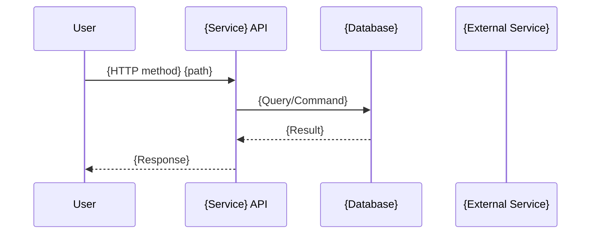

# SKILL: mermaid-diagrams
# Phase: P03 Architecture — Phase 11

## Mermaid Diagrams

**Purpose:** Identify which diagrams to generate and add them to the Architecture output.

### Diagram Types

**Sequence Diagrams (Data Flows):**
- For each requirement with meaningful data flow: generate a sequence diagram showing the request path from User → API → Services → DB → Response

**Component Diagrams (Service Architecture):**
- Overall system: all services, ALB, databases, integrations

**Data Flow Diagrams:**
- For complex flows with multiple services or async messaging

### Ask First

"I'll create Mermaid diagrams for:

**Sequence Diagrams:**
- {REQ-001}: {Flow name} (User → API → DB → response)
- {REQ-005}: {Flow name} (with external service calls)

**Component Diagrams:**
- Overall system: {N} services, ALB, databases, integrations

Should I create these diagrams?"

### Sequence Diagram Template



### Component Diagram Template

```mermaid
graph TB
    ALB[Application Load Balancer]
    SVC1[{Service 1}]
    DB1[(Aurora PostgreSQL)]
    SVC1 --> DB1
    ALB --> SVC1
```

### Location

Diagrams are added to the `### Diagrams` sub-section of each relevant requirement's Architecture section, and to a project-level `architecture/SYSTEM_OVERVIEW.md`.
